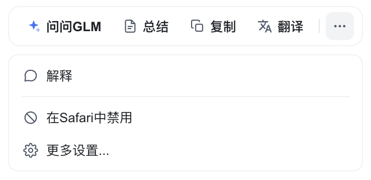
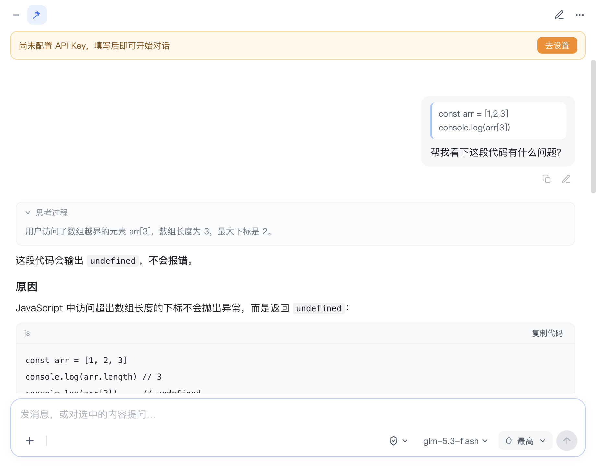
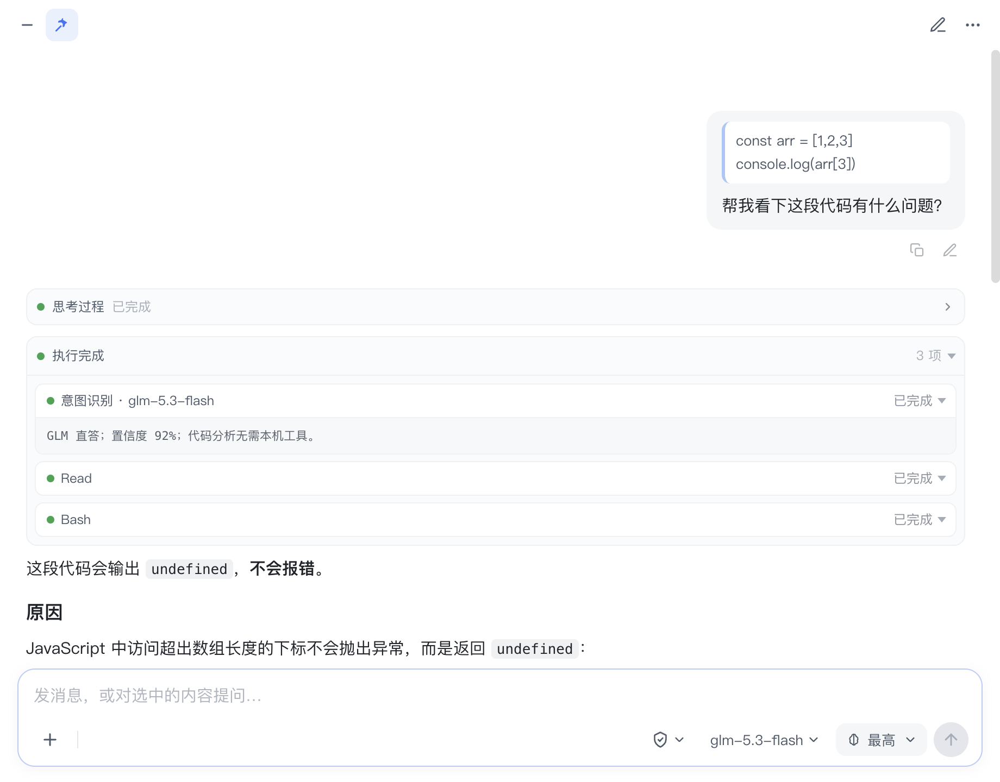
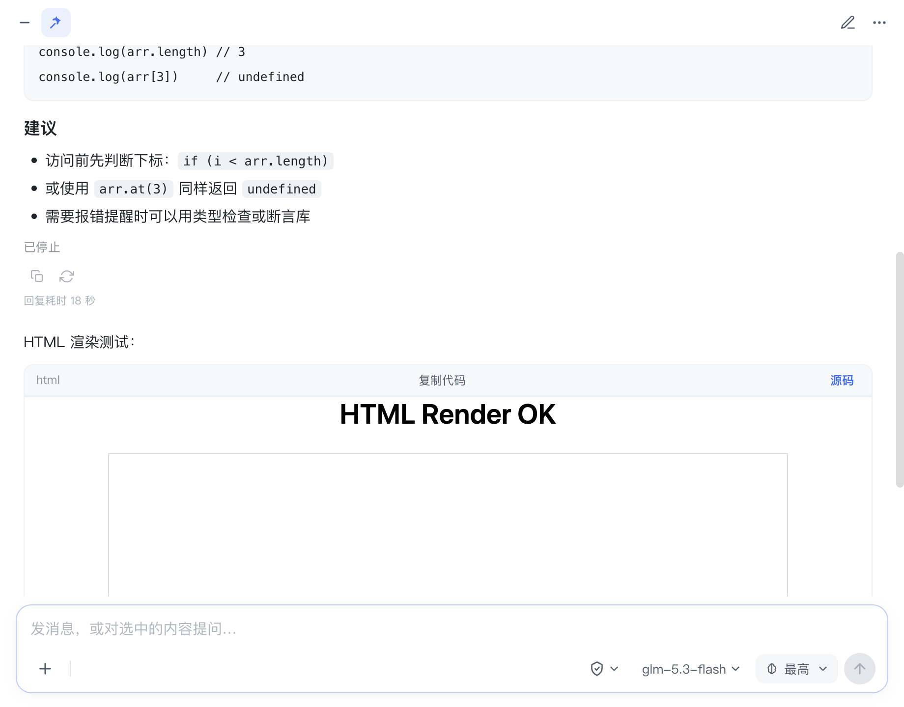
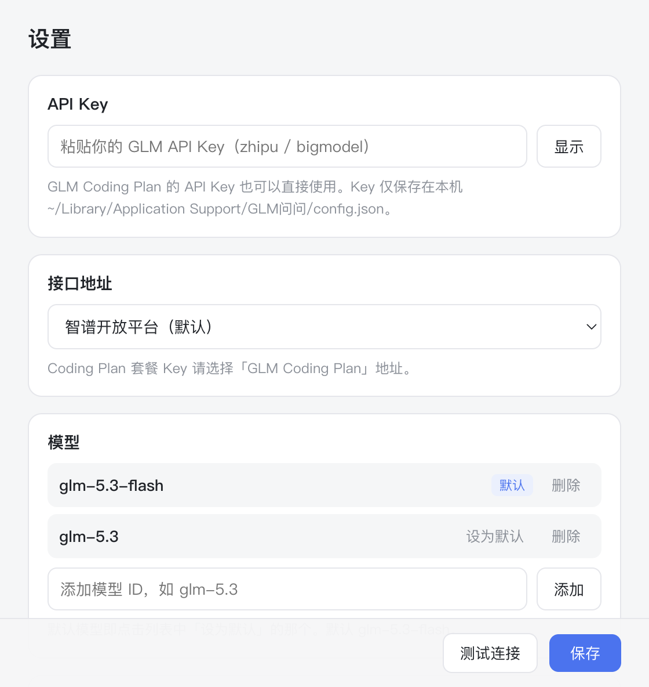

# GLM问问 — 豆包风格的划词问答 Mac 应用

对齐豆包桌面端的划词交互：**任意应用中选中文字 → 弹出工具条 → 「问问GLM」打开弹窗 → 基于选中内容持续对话**。接入你自己的 GLM API Key（GLM Coding Plan 套餐 Key 可直接使用），默认模型 `glm-5.3-flash`，支持切换模型。

  

## 产品预览







## 功能一览

| 功能 | 说明 |
|---|---|
| 划词工具条 | 任意应用**拖选或双击选词**后，在选区附近弹出「问问GLM / 总结 / 复制 / 翻译 / ⋯」；工具条只在确认复制出文本后出现——截图框选、拖图标、拖窗口等不会误弹；「⋯」展开下拉菜单（解释 / 在此应用中禁用 / 更多设置…） |
| 截图友好 | 检测到截图快捷键（⌘⌥A / ⌘⇧A / ⌥A，微信/QQ/钉钉/飞书截图默认键）后 12 秒内不发模拟 ⌘C，不会打断截图流程 |
| 问一问弹窗 | 选中内容以引用条形式挂在输入框上（可 × 移除），输入问题发送，流式回复 |
| 弹窗内追问 | 在回复里选中任意文字 → 出现「复制 / 追问」迷你条，追问会引用该段内容 |
| 编辑重发 | 自己发送的消息底部有常驻的复制/编辑操作栏，编辑保存后自动截断后续对话并重新生成 |
| 终止生成 | 流式回复时发送按钮变为停止按钮，点击即终止并保留已生成部分 |
| 重新生成 | 助手消息下方 ↻ 图标，重发同一轮对话 |
| 图片 / 文件 | 输入框 `+` 上传图片（多模态，最多 6 张）与任意文件（≤10MB；文本内容随消息发送，二进制文件可将本地路径交给本地 Agent 处理）；支持直接粘贴图片 |
| 思考过程 | 支持模型的 `reasoning_content`，折叠展示，内容开始输出后自动收起 |
| Agent 执行链路 | 独立模型识别意图；执行过程、工具调用、状态圆点和结果详情按层级展示 |
| 回复耗时 | 每次回复完成后展示总耗时，包含意图识别与 Agent / GLM 执行阶段 |
| 新话题 / 历史 | 标题栏 ✏️ 新开话题；「⋯ → 历史话题」查看/恢复/删除近 50 个会话 |
| 模型切换 | 输入框右下角模型名点击切换；设置页可增删模型、设默认 |
| 本地 Agent 复用 | 自动发现 ZCode / Claude Code / Codex 本地的 Skill、MCP、Plugin；GLM 回答会优先命中这些能力，也可从输入框盾牌菜单把任务交给本地 Agent headless 执行 |
| 弹窗置顶 | 问一问弹窗默认浮在所有应用窗口之上，快捷键会在**当前桌面**唤起（不会跳回原桌面）；📌 可取消置顶 |
| 开机自启动 | 设置页可开启登录后后台启动；不会自动弹出问一问窗口，可继续用快捷键唤起 |
| 切桌面即隐藏 | `Ctrl + ←/→/↑/↓` 和 Mission Control 切换时会收起弹窗和工具条；弹窗内的双指横滑不会误触发隐藏 |
| 快捷键 | `Command + Shift + Space` 全局唤起/收起弹窗；注册失败自动重试并在设置页显示状态。若显示已注册但仍无响应，多为输入法占用了该组合，请在输入法设置中关闭对应快捷键 |
| 按应用禁用 | 工具条下拉「在此应用中禁用」，黑名单可在设置中移除 |

## 快速开始

### 方式一：下载 Release

1. 打开仓库的 [Releases](../../releases) 页面。
2. 下载 `GLM-Ask-0.1.3-arm64-mac.zip` 或 `GLM-Ask-0.1.3-arm64.dmg`。
3. 将 `GLM问问.app` 拖到 `/Applications`。
4. 首次打开时右键 App → 「打开」，确认一次 Gatekeeper 提示。
5. 打开设置，填入 GLM API Key 并保存。

### 方式二：本地开发

```bash
npm install         # 会自动编译原生划词助手（失败会自动降级，见下文）
npm start
```

首次启动：

1. 若未授予辅助功能权限，会自动弹出**权限引导窗口**：点「打开系统设置」→ 勾选 GLM问问（开发模式勾选运行它的终端 App）→ 回来点「重新检测」。**检测成功立即生效，无需重启**（应用每 2.5 秒轮询授权状态，授权后划词自动激活，引导窗口自动关闭）
2. 弹窗内会提示「去设置」→ 粘贴 API Key
3. 接口地址按你的 Key 类型选择：
   - 智谱开放平台普通 Key：`https://open.bigmodel.cn/api/paas/v4`（默认）
   - **GLM Coding Plan 套餐 Key**：`https://open.bigmodel.cn/api/coding/paas/v4`
   - Z.ai 国际版对应两个 coding 地址也有预设
4. 点「测试连接」确认可用 → 保存

### 系统权限（重要）

划词工具条依赖两项系统权限（**开发模式（npm start）下授权对象是你运行命令的终端 App**；打包后的 .app 则是 GLM问问 本身）：

- **辅助功能 / 输入监控**：系统设置 → 隐私与安全性 → 辅助功能（监听鼠标、注入 Cmd+C、读取选中文本）
- **自动化**（如弹出）：允许控制「系统事件」

设置页提供「检测辅助功能权限」一键自查（检测以本进程能否创建事件钩子为准，结果准确）与「权限引导」窗口入口。未授权时 `Command+Shift+Space` 唤起的弹窗仍可正常手动使用。

## 开发与打包

```bash
npm install         # 安装依赖、生成静态资源、编译原生助手
npm run typecheck   # TypeScript 类型检查
npm start           # 构建并启动开发版
npm run smoke       # 构建并运行 UI 自检
npm run dist        # 构建并产出 release/ 下的 dmg + zip（arm64）
```

## 选中文本的获取方式

两级策略，自动选择：

1. **原生助手（推荐）**：`npm install` 时编译 `src/native/get_selected_text.swift` → 通过 AX API 直接读选中文本，**不污染剪贴板**。编译失败时自动走兜底。
2. **Cmd+C 模拟（兜底，默认可用）**：模拟 ⌘C 读取剪贴板后自动恢复原内容。极少数应用（如部分终端）⌘C 语义不同，可将其加入黑名单。

未授予辅助功能权限时，工具条不会弹出（启动时会自动弹出权限引导窗口），但 `Command+Shift+Space` 唤起的弹窗仍可正常手动使用。

## 项目结构

```
src/
  main/
    main.ts        # 窗口编排、IPC、划词流程
    selection.ts   # 全局鼠标手势 + 选中文本捕获（AX 助手 / Cmd+C 兜底）
    llm.ts         # GLM OpenAI 兼容端点流式调用（主进程转发，可终止）
    localAgents.ts # 本机 ZCode / Claude / Codex 的 Skill、MCP、Plugin 发现与复用
    store.ts       # 配置与会话历史持久化（userData 下 JSON）
    smoke.ts       # 自检：示例数据渲染 + 截图（GLM_ASK_SMOKE=1）
  native/
    get_selected_text.swift   # 可选原生划词助手
  preload/         # contextBridge API（toolbar / ask / settings）
  renderer/        # 三个窗口的 UI（原生 HTML/CSS + TypeScript，marked + DOMPurify）
  scripts/vendor.ts # 拷贝渲染层依赖 + 编译原生助手
```

TypeScript 源码编译到 `dist/`；`dist/` 与原生助手产物不入库。

## 端到端回归测试

除 smoke（`GLM_ASK_SMOKE=1`，渲染截图 + 置顶/保存关闭断言）外，还提供真实输入回归脚本：

```bash
pip3 install pyobjc-framework-Quartz   # 预编译 wheel，无需编译环境
pgrep -f "GLM问问.app/Contents/MacOS/GLM问问"   # 取主进程 pid
python3 scripts/drag-e2e.py <pid>
```

脚本会打开 TextEdit，合成真实鼠标拖选/双击与 ⌘⇧Space 按键，断言：拖选弹工具条、双击不弹、点击他处收起、快捷键开合。用于划词链路的回归验证。

## 已知限制

- 划词仅支持鼠标拖选与双击选词，暂不支持键盘 Shift+方向键选词
- 文件附件最大 10MB；文本内容直接注入对话，二进制内容需由本地 Agent 读取本地路径
- 未做代码语法高亮、公式渲染
- 应用未签名，首次打开打包产物需右键 → 打开（或在系统设置中允许）
